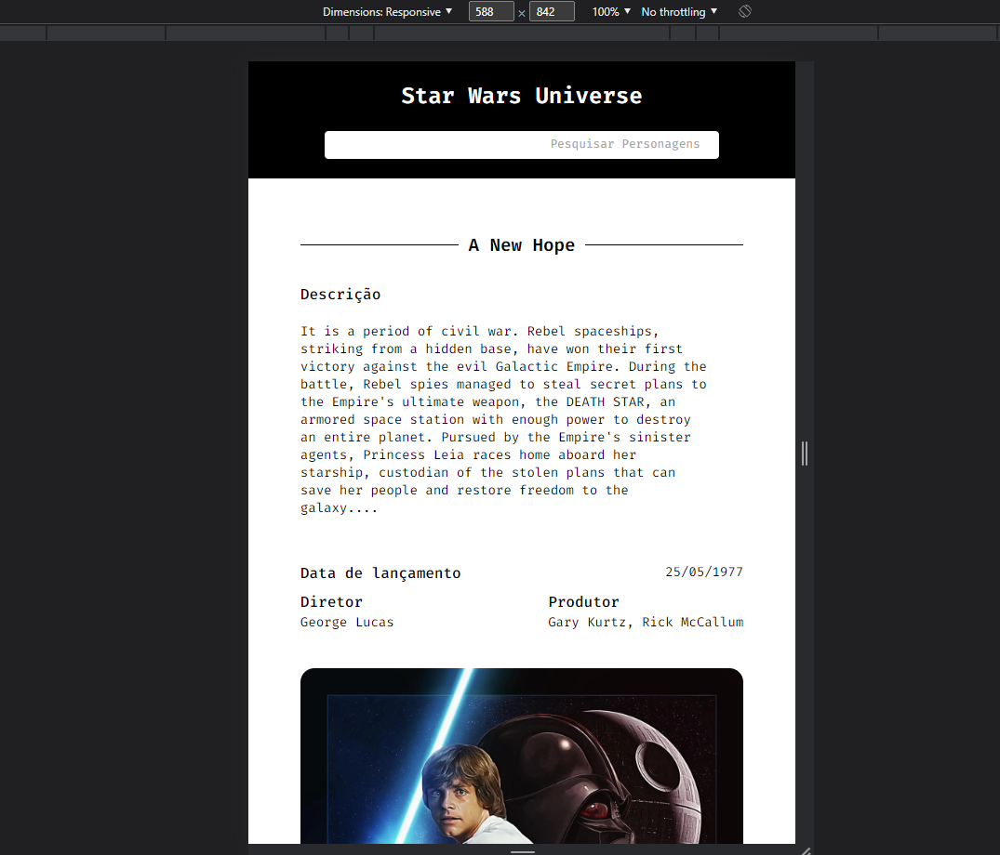

## Table of contents

-   [General info](#Informações sobre o projeto)
-   [Installation](#Instalação)
-   [Features](#Funcionalidades)
-   [Technologies](#tecnoilogias)
-   [License](#License)
-   [Demo](#Demo)

## **Informações sobre o projeto**

Para a construção desse app foram utilizadas as seguintes tecnologias como React js, Axios, Styled-Components e Swiper.

## **Funcionalidades**

Essa aplicação possui 2 páginas, sendo a homepage composta por um carrosel com os filmes clássicos de Star Wars e logo abaixo contém outro carrosel contendo os personagens mais icônicos dessa famos franquia.

Ao clicar sobre a imagem do carrosel o usuário será levado para segunda página onde contém detalhes sobre o filme e elenco.
Também há possibilidade de fazer um comentário sobre o filme.

Esse projeto se encontra hospedado no seguinte endereço: https://realty-estate-app.vercel.app

## **Tecnologias usadas**

-   <a href="https://pt-br.reactjs.org/">React</a>
-   <a href="https://reach.tech/router/">Reach Router</a>
-   <a href="https://axios-http.com/ptbr/docs/intro">Axios</a>
-   <a href="https://styled-components.com/">Styled-components</a>
-   <a href="https://swiperjs.com/">Swiper JS</a>

## **Instalação**

Para poder rodar esse app localmente é necessário o NodeJS >= v14 instalado em sua máquina, um editor de texto de sua preferência.
Na raiz do projeto execute o comando 'npm install' e após todos os arquivos necessários serem baixados, dentro do mesmo diretório execute 'npm start' para que o projeto se inicie.
Após a execução do comando abra um navegador de sua preferência e digite 'http://localhost:3000' para visualizar o projeto na web.

## **License**

[MIT](https://choosealicense.com/licenses/mit/)

## **Demo**

\*HomePage

\*Detalhes

\*Mobile

